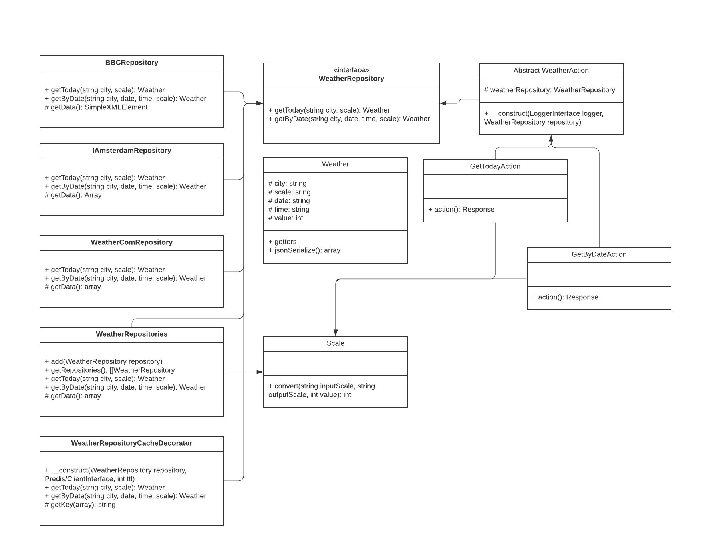

# Weather application
This application collecting data from few sources and get an average
value in client scale. Requests using cache, which collecting in Redis with TTL = 60 seconds

You can find demo application [here](gromnsk.ru:81)

few examples:

    /weather/amsterdam/2020-02-26/22:00
    /weather/amsterdam
    /weather/amsterdam/2020-03-26/22:00 // wrong request, more than 10 days

# How to start service
you just need to run docker-compose

    docker-compose up -d
    
# Mock data

service using generated data for last 20 days from February 24th, if you want to generate 
new one you just need to run

    php generate_data.php
    
this script generate 3 files in csv, json and xml formats and put it in `files` folder

# how to add new integration

Implement new `WeatherRepository` integration, 
then in `app/repositories.php` add one more repository in containerBuilder. That's enough to start using
one more integration

# how-to add new scale

open `src/Domain/Weather/Scale.php`, add new constants and implement convertion from all scales to new one and vice-versa

# Class diagram

